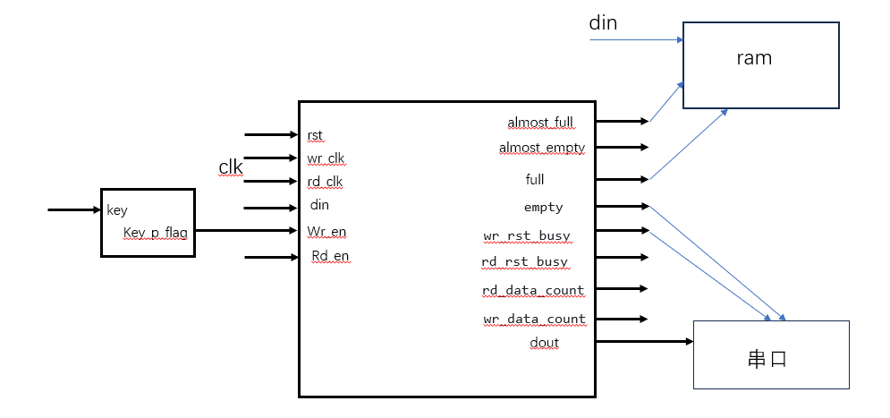

********ADC data acquisition and storage system based on on-chip memory******************
**Requirement: Serial port sends acquisition instructions
        Adc collects a large amount of data and stores it in the ram system
        After pressing the button, the ram data is output.
        Use fifo to ensure that the order of data is error-free
        Output to serial port
**Logic block diagram: 

Module 1: Serial communication module Baud rate: 9600
    Function: The data format sent is ff + a0 + xx + ff, where ff a0 is the check data, xx is the collection quantity, and ff is the end check data.
    Block diagram: 
    Description: After the completion signal rx_done generated by the serial port receiving module, it is input to the frame processing module. After repeated execution four times, it detects that the conditions are met and generates the frame completion signal uart_cmd_done and the collection number uart_cmd_num.

Module 2: adc collection and data conversion module
    Function: perform adc collection based on the number of collections generated by the serial port and store them in ram
    Block diagram:
    Description: After obtaining the uart_cmd_done signal, generate the sampling sample_adc_start pulse, perform sampling, output 16-bit data adc_data and sampling completion signal adc_change_done, perform sampling counting sample_cnt until the sampling quantity sample_target is reached, then stop sampling, and output the sampling data to the ram module at the same time

Module 3: ram storage module
    Function: Save the data collected by adc. After pressing key1, output the data to fifo module.
    block diagram:
    Description: When adc_change_done and sampling are valid, pull up the wea and ena signals and write adc_data into ram. The adc collection completion signal adc_change_done is valid. Input it to ram and finally get the total storage quantity stored_sample_count. After pressing the key1 key, output the data to the fifo module. The input is 16 bits and the output is also 16 bits.

Module 4: fifo module
    Function: Ensure that the sequence of data is error-free, output to the serial port, input 16 bits, output 8 bits, output the high bit first and then the low bit.
    block diagram:
    Description: After pressing key1, use the state machine to ensure that the data is input from ram to fifo in order and ensure the consistency of the timing. Read all the information inside the ram and output the module to the serial port. 8-bit output mode. Transmit the high bit first and then the low bit.

Module 5: Serial port sending module
    Function: Send the data output by the fifo module to the serial port
    Description: Use the state machine to ensure that the data is input from the fifo to the serial port in order and ensure the consistency of the timing. Read all the information inside the fifo and output the module to the serial port. 8-bit output mode. Transmit the high bit first and then the low bit.
