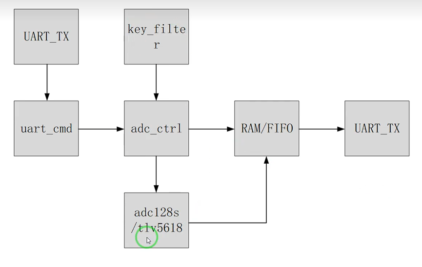
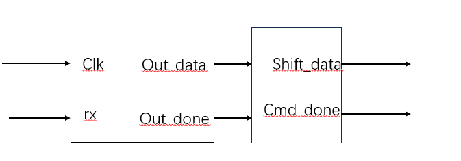
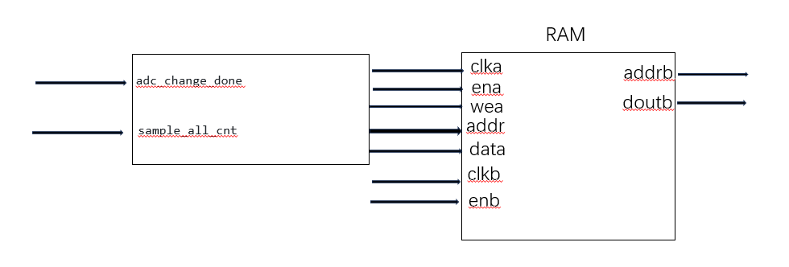

********基于片上存储器的adc数据采集存储系统******************
**需求：串口发送采集指令
        Adc进行大量采集存储在ram系统中
        按键按下之后进行ram的数据输出
        使用fifo保证数据的顺序无错误
        输出给串口
**逻辑框图：

模块1：串口通信模块
    作用：发送的数据格式 ff + a0 + xx + ff    其中 ff a0 为校验数据 xx 为采集数量 ff 为结尾校验数据
    框图：
    描述：串口接收模块产生的完成信号 rx_done 之后 输入给帧处理模块 反复执行四次之后 检测满足条件 产生帧完成信号uart_cmd_done 和采集数量 uart_cmd_num

模块2：adc采集以及数据转化模块
    作用：根据串口产生的采集数量进行 adc采集 存储在ram中
    框图：
    描述：获得uart_cmd_done信号后 产生采样sample_adc_start脉冲 进行采样 输出16位数据 adc_data 和采样完成信号 adc_change_done 进行采样计数 sample_cnt 直到达到采集数量 sample_target 之后停止采样 同时输出采样数据给ram模块

模块3：ram存储模块 
    作用：保存adc采集的数据 按下按键key1之后 输出数据给fifo模块
    框图：
    描述：当adc_change_done以及sampling有效时 拉高wea、ena信号 将adc_data写入ram中 adc采集完成信号adc_change_done有效 输入给ram 最终得到总体存储数量stored_sample_count 按下按键key1之后 输出数据给fifo模块 输入是16位 输出也是16位 

